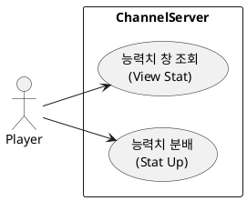
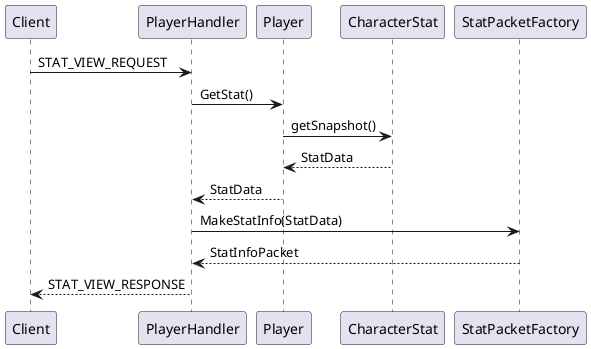
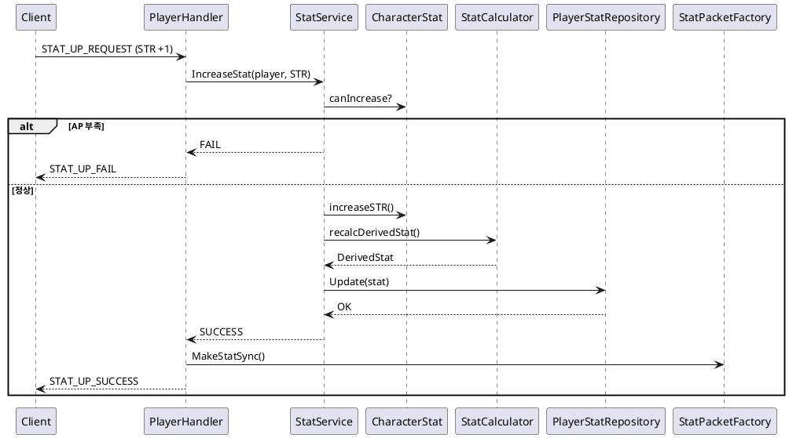
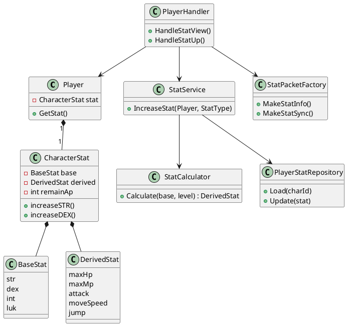
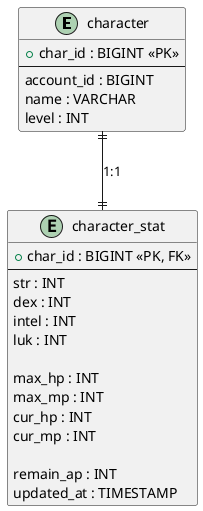

오케이 👍
지금 상태 딱 **“MMORPG 서버에서 스탯 시스템 뼈대 잡기”** 들어가기 좋은 시점이야.
아래는 **실무 기준 + 네 프로젝트 구조(ChannelD)에 딱 맞춘 가이드**로 정리해줄게.

---

# 1️⃣ 구현 순서 가이드 (중요)

> **순서 틀리면 중간에 설계 갈아엎게 됨**
> → “데이터 구조 → 도메인 로직 → 핸들러(Op) → 패킷” 순서 고정

---

## ✅ STEP 1. 능력치 도메인 정의 (가장 먼저)

### 1-1. 능력치 분류부터 정리

능력치를 **성격별로 분리**해야 나중에 장비 / 버프 / 패시브 붙이기 쉬워짐

```text
[Base Stat]   : STR / DEX / INT / LUK
[Derived Stat]: MaxHP / MaxMP / ATK / MoveSpeed / Jump
[Runtime Stat]: CurrentHP / CurrentMP
```

👉 **중요 포인트**

* `총공격력`은 **DB에 저장 ❌**
* `HP / MP`는

  * Max / Current 분리
* 이동속도, 점프력은 기본값 + 보정값 구조 추천

---

### 1-2. C++ 구조체 (도메인 모델)

📁 `core/stat/CharacterStat.h` (신규)

```cpp
struct BaseStat {
    int str;
    int dex;
    int intel;
    int luk;
};

struct DerivedStat {
    int maxHp;
    int maxMp;
    int attack;
    int moveSpeed;
    int jump;
};

struct RuntimeStat {
    int currentHp;
    int currentMp;
};
```

👉 이건 **DB랑 1:1 대응 아님**
👉 “게임 규칙의 중심 모델”임

---

## ✅ STEP 2. DB 테이블 설계 (char_id 기준)

### 2-1. DB 테이블 분리 (GOOD 판단 👍)

```sql
CREATE TABLE character_stat (
    char_id     BIGINT PRIMARY KEY,
    str         INT NOT NULL,
    dex         INT NOT NULL,
    intel       INT NOT NULL,
    luk         INT NOT NULL,
    max_hp      INT NOT NULL,
    max_mp      INT NOT NULL,
    cur_hp      INT NOT NULL,
    cur_mp      INT NOT NULL,
    level       INT NOT NULL,
    remain_ap   INT NOT NULL,
    updated_at  TIMESTAMP
);
```

📌 **remain_ap 필수**

* 레벨업 → 스탯 찍는 구조
* Op 구현이 깔끔해짐

---

### 2-2. DB 접근 책임 분리

📁 `db/PlayerStatRepository.h` (신규)

```cpp
class PlayerStatRepository {
public:
    CharacterStat Load(int64_t charId);
    void Update(const CharacterStat& stat);
};
```

👉 DB는 **Repository에서만**
👉 Player / Handler에서 SQL 직접 치면 ❌

---

## ✅ STEP 3. Player에 Stat 컴포지션 추가

📁 `core/Player.h`

```cpp
class Player {
public:
    CharacterStat& GetStat();
    void ApplyStat();

private:
    CharacterStat stat_;
};
```

📌 **핵심**

* Player는 Stat을 **소유**
* 계산 로직은 Player or StatService

---

## ✅ STEP 4. 스탯 계산 로직 분리 (중요!)

> “스탯 계산 = 게임 룰”
> → 핸들러 / DB / Player에서 하면 망함

📁 `core/stat/StatCalculator.h` (신규)

```cpp
class StatCalculator {
public:
    static DerivedStat Calculate(const BaseStat& base, int level);
};
```

예:

```cpp
attack = base.str * 2 + base.dex;
maxHp  = 100 + base.str * 10 + level * 5;
```

👉 나중에

* 직업
* 장비
* 버프
  여기만 건드리면 됨

---

## ✅ STEP 5. Op(핸들러) 설계 (2개)

---

### 5-1. 능력치 창 보여주는 Op

**Flow**

```
Client → StatWindowRequest
 → PlayerHandler
   → Player.GetStat()
   → PacketFactory
 → Client
```

📁 `packet/PlayerHandler.cpp`

```cpp
void PlayerHandler::HandleStatInfo(Player& player)
{
    auto& stat = player.GetStat();
    SendStatInfoPacket(stat);
}
```

---

### 5-2. 레벨업 / 스탯 분배 Op

**Flow**

```
Client → StatUpRequest (STR +1)
 → Validate (remain_ap > 0)
 → Apply BaseStat
 → Recalculate DerivedStat
 → DB Update
 → Sync Packet
```

📌 여기서 중요한 것

* **원자성**
* 실패 시 롤백

---

## 2️⃣ 적용하면 좋은 디자인 패턴

---

## 🎯 1. Command Pattern (이미 쓰는 구조랑 잘 맞음)

* Op = Command
* `/stat`, `STAT_UP`

```cpp
class IStatCommand {
public:
    virtual void Execute(Player&) = 0;
};
```

👉 `StatViewCommand`, `StatUpCommand`

---

## 🎯 2. Service + Repository 패턴 (DB 보호)

```text
Handler
 → StatService
   → StatCalculator
   → PlayerStatRepository
```

📌 **Handler는 얇게**

---

## 🎯 3. Domain Model 패턴 (중요)

* `CharacterStat`은 단순 DTO ❌
* 최소한의 행위 포함

```cpp
void CharacterStat::IncreaseStr() {
    if (remainAp <= 0) return;
    base.str++;
    remainAp--;
}
```

---

## 🎯 4. Observer (후순위, 확장용)

* HP 변경 → UI, 로그, 데미지 체크
* 지금은 안 해도 됨

---

## 3️⃣ 추천 폴더 구조 (Channel 기준)

```text
CHANNEL
├── core
│   ├── stat
│   │   ├── CharacterStat.h
│   │   ├── StatCalculator.h
│   │   └── StatService.cpp
│   ├── Player.cpp
│   └── ...
├── db
│   ├── PlayerStatRepository.cpp
│   └── ...
├── packet
│   ├── PlayerHandler.cpp
│   ├── StatPacketFactory.cpp   ← 분리 추천
│   └── ...
```

---

## 4️⃣ 핵심 요약 (이거 기억해)

✔ 스탯은 **DB가 아니라 도메인 모델이 중심**
✔ 계산 로직은 **한 곳에 모아라 (StatCalculator)**
✔ Handler는 **입출력만**
✔ 레벨업 Op = **가장 위험한 트랜잭션 포인트**

---

다음 단계로 원하면 👇

* **Stat 패킷 구조 설계**
* **레벨업 수식 추천**
* **장비/버프까지 확장 가능한 구조**
* **Redis 캐싱 포인트**

중에 하나 바로 들어가자.
이건 잘 만들면 ChannelD 퀄리티 확 올라간다 🔥


좋아, 이건 **“보고 그대로 코딩 들어갈 수 있는 UML 세트”**로 만들어줄게.
말 그대로 **설계도** 역할을 하게끔 **현실적인 흐름 + 네 Channel 구조 기준**으로 간다.

아래 UML들은 **서버 관점(ChannelD)** 기준이고,
Client는 “요청자” 정도로만 등장시킨다.

---

# 1️⃣ 유스케이스 다이어그램 (Use Case)

> 👉 “누가 무엇을 할 수 있는가”
> 👉 Op 정의용 / 기능 범위 합의용

### 🎯 포인트

* Actor: Player(Client)
* System: ChannelServer
* UseCase 2개

  * 능력치 조회
  * 능력치 분배(레벨업)

---

### ✅ PlantUML – Use Case



📌 이 UML은

* “Op가 몇 개인지”
* “권한은 누가 갖는지”
  정리할 때 쓰기 딱 좋다.

---

# 2️⃣ 시퀀스 다이어그램 (Sequence Diagram)

> 👉 **가장 중요**
> 👉 이거 보면서 그대로 코드 흐름 짜면 됨

아래는 **2개 시퀀스**를 한 파일에 넣어줄게.

---

## 2-1. 능력치 창 조회 시퀀스

### 🎯 흐름 요약

```
Client
 → PlayerHandler
   → Player
     → CharacterStat
   → PacketFactory
 → Client
```

---

### ✅ PlantUML – Stat View Sequence



📌 이거 보면서 만들 코드:

* `HandleStatView()`
* `GetStat()`
* `MakeStatInfoPacket()`

---

## 2-2. 능력치 분배 (레벨업) 시퀀스

### 🎯 핵심 포인트

* 검증
* 계산
* DB 업데이트
* 결과 응답

---

### ✅ PlantUML – Stat Up Sequence



📌 이 시퀀스는

* **트랜잭션 기준**
* **실패/성공 분기**
  까지 포함한 “실전용”

---

# 3️⃣ 클래스 다이어그램 (Class Diagram)

> 👉 **구조 이해 + 파일 분리 기준**
> 👉 이거 보고 헤더부터 만들면 됨

---

### 🎯 클래스 책임 요약

| 클래스                  | 책임       |
| -------------------- | -------- |
| Player               | 캐릭터 단위   |
| CharacterStat        | 능력치 도메인  |
| StatCalculator       | 계산 로직    |
| StatService          | 유스케이스 로직 |
| PlayerStatRepository | DB       |
| PlayerHandler        | Op 처리    |
| StatPacketFactory    | 패킷 생성    |

---

### ✅ PlantUML – Class Diagram



📌 이 다이어그램 기준으로

* 폴더 나누기
* 헤더 만들기
* cpp 구현
  들어가면 **절대 길 안 잃음**

---

# 🔥 정리

이 3개 UML 역할은 이렇게 써먹어라:

1️⃣ **Use Case**
→ “Op 몇 개인지 / 범위 확정”

2️⃣ **Sequence**
→ “Handler / Service / Repo 코드 순서 그대로”

3️⃣ **Class Diagram**
→ “파일 구조 + 책임 분리 기준”

---

다음으로 바로 갈 수 있는 것 👇

* 📦 **패킷 구조 UML**
* 🧮 **스탯 수식 정리 + 표**
* 🧱 **장비/버프 확장 UML**
* 🗄️ **Redis 캐싱 시퀀스**

👉 다음 뭐 할지 딱 하나만 골라.


좋아 👍
이건 **“DB 테이블 보면서 Repository 코드 바로 칠 수 있는 수준”**으로 만들어줄게.
**ERD + 컬럼 의미가 한눈에 보이게** 설계한다.

아래 UML은 **ChannelD 기준 / MySQL 기준 / char_id 중심 설계**야.

---

# 📊 Character Stat DB 설계 (ER Diagram)

## 🎯 설계 의도 요약

* **char_id = PK**
* Player 기본 정보 테이블과 **1:1 관계**
* 스탯 계산용 컬럼 vs 런타임 컬럼 분리
* 레벨업 & 스탯 분배를 고려한 구조

---

## ✅ PlantUML – DB ER Diagram



---

## 🧠 컬럼 의미 정리 (이해용)

### 🔹 Base Stat (직접 증가)

```text
str / dex / intel / luk
```

* 레벨업 시 증가 대상
* 클라이언트에서 직접 조작 ❌ (Op 통해서만)

---

### 🔹 Derived Stat (계산 결과)

```text
max_hp / max_mp
```

* base stat + level 기반 계산 결과
* DB 저장 → 재접속 시 복원용

---

### 🔹 Runtime Stat (실시간 값)

```text
cur_hp / cur_mp
```

* 전투 / 회복에 따라 수시 변경
* Redis 캐싱 대상 1순위

---

### 🔹 remain_ap

```text
remain_ap
```

* 레벨업 시 증가
* 스탯 분배 시 감소
* **StatUp Op 검증 핵심 컬럼**

---

## 🧱 Repository 코드와 1:1 매핑 예시

📁 `PlayerStatRepository.cpp`

```cpp
SELECT
    str, dex, intel, luk,
    max_hp, max_mp,
    cur_hp, cur_mp,
    remain_ap
FROM character_stat
WHERE char_id = ?;
```

```cpp
UPDATE character_stat
SET
    str = ?, dex = ?, intel = ?, luk = ?,
    max_hp = ?, max_mp = ?,
    cur_hp = ?, cur_mp = ?,
    remain_ap = ?,
    updated_at = NOW()
WHERE char_id = ?;
```

👉 UML 보고 컬럼 하나라도 헷갈리면 ❌
👉 지금 구조는 **코드-DB-도메인 3개가 정확히 겹침**

---

## 🔥 확장 대비 (지금은 안 만들어도 되는 것)

추후 확장 시 **절대 character_stat에 추가하지 말 것**:

* 장비 보정
* 버프
* 패시브 스킬

👉 이건 별도 테이블

```text
character_equip_stat
character_buff_stat
```

---

## ✅ 최종 정리

✔ ERD = DB 설계 + Repository 설계 기준
✔ char_id 1:1 구조 → Player 로딩 단순
✔ remain_ap 포함 → 레벨업 Op 안정
✔ Redis 캐싱/비동기 저장에도 적합

---

다음으로 이어가기 좋다 👇

* 🧩 **Redis 캐싱 구조 ERD**
* 🗄️ **장비 스탯 테이블 ERD**
* ⚔️ **전투 데미지 계산 시퀀스**
* 🔄 **Stat 변경 시 DB/Redis 동기화 UML**

원하는 거 하나만 콕 집어.
