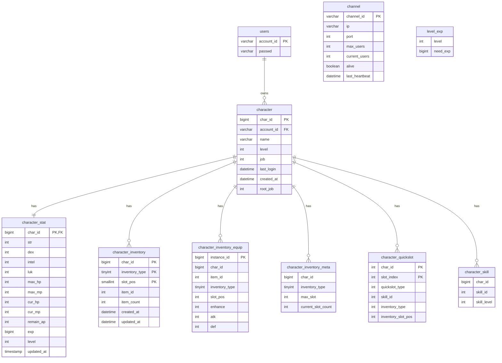

# Database Design Document

## 1. 개요

본 문서는 LL2Games RPG 프로젝트의 `game` 데이터베이스 구조를 정의한다.

데이터베이스는 계정, 캐릭터, 캐릭터 능력치, 인벤토리, 스킬, 퀵슬롯, 채널 서버 정보를 관리한다.

---

## 2. ERD 개요



---

## 3. 테이블 목록

| 테이블명                      | 설명                |
| ------------------------- | ----------------- |
| account                   | 계정 생성 정보          |
| users                     | 로그인 계정 정보         |
| character                 | 캐릭터 기본 정보         |
| character_stat            | 캐릭터 능력치 정보        |
| character_inventory       | 캐릭터 소비/기타 인벤토리 정보 |
| character_inventory_equip | 캐릭터 장비 인벤토리 정보    |
| character_inventory_meta  | 캐릭터 인벤토리 슬롯 메타 정보 |
| character_quickslot       | 캐릭터 퀵슬롯 정보        |
| character_skill           | 캐릭터 보유 스킬 정보      |
| channel                   | 채널 서버 상태 정보       |
| level_exp                 | 레벨별 필요 경험치 정보     |

---

# 4. 테이블 상세

## 4.1 account

계정의 생성 시각을 저장하는 테이블이다.

| 컬럼명        | 타입          | NULL | KEY | 기본값  | 설명       |
| ---------- | ----------- | ---- | --- | ---- | -------- |
| account_id | varchar(64) | NO   | PK  |      | 계정 ID    |
| created_at | datetime    | YES  |     | NULL | 계정 생성 시각 |

```sql
CREATE TABLE `account` (
  `account_id` varchar(64) COLLATE utf8mb4_unicode_ci NOT NULL,
  `created_at` datetime DEFAULT NULL,
  PRIMARY KEY (`account_id`)
) ENGINE=InnoDB DEFAULT CHARSET=utf8mb4 COLLATE=utf8mb4_unicode_ci;
```

---

## 4.2 users

로그인 계정 정보를 저장하는 테이블이다.

| 컬럼명        | 타입           | NULL | KEY | 기본값 | 설명    |
| ---------- | ------------ | ---- | --- | --- | ----- |
| account_id | varchar(64)  | NO   | PK  |     | 계정 ID |
| passwd     | varchar(255) | NO   |     |     | 비밀번호  |

```sql
CREATE TABLE `users` (
  `account_id` varchar(64) CHARACTER SET utf8mb4 COLLATE utf8mb4_unicode_ci NOT NULL,
  `passwd` varchar(255) CHARACTER SET utf8mb4 COLLATE utf8mb4_unicode_ci NOT NULL,
  PRIMARY KEY (`account_id`)
) ENGINE=InnoDB DEFAULT CHARSET=utf8mb4 COLLATE=utf8mb4_unicode_ci;
```

---

## 4.3 character

캐릭터 기본 정보를 저장하는 테이블이다.

| 컬럼명        | 타입          | NULL | KEY    | 기본값            | 설명         |
| ---------- | ----------- | ---- | ------ | -------------- | ---------- |
| char_id    | bigint      | NO   | PK     | AUTO_INCREMENT | 캐릭터 고유 ID  |
| account_id | varchar(64) | NO   | FK     |                | 계정 ID      |
| name       | varchar(32) | NO   | UNIQUE |                | 캐릭터 이름     |
| level      | int         | YES  |        | 1              | 캐릭터 레벨     |
| job        | int         | YES  |        | NULL           | 직업         |
| last_login | datetime    | YES  |        | NULL           | 마지막 로그인 시각 |
| created_at | datetime    | YES  |        | NULL           | 캐릭터 생성 시각  |
| root_job   | int         | YES  |        | 0              | 캐릭터 0차 직업  |

```sql
CREATE TABLE `character` (
  `char_id` bigint NOT NULL AUTO_INCREMENT,
  `account_id` varchar(64) COLLATE utf8mb4_unicode_ci NOT NULL,
  `name` varchar(32) COLLATE utf8mb4_unicode_ci NOT NULL,
  `level` int DEFAULT '1',
  `job` int DEFAULT NULL,
  `last_login` datetime DEFAULT NULL,
  `created_at` datetime DEFAULT NULL,
  `root_job` int DEFAULT '0' COMMENT '캐릭터 0차 직업',
  PRIMARY KEY (`char_id`),
  UNIQUE KEY `uk_account_char` (`account_id`,`name`),
  KEY `idx_account_id` (`account_id`),
  KEY `idx_character_account_id` (`account_id`),
  CONSTRAINT `fk_character_users`
    FOREIGN KEY (`account_id`)
    REFERENCES `users` (`account_id`)
    ON DELETE CASCADE
    ON UPDATE CASCADE
) ENGINE=InnoDB AUTO_INCREMENT=15 DEFAULT CHARSET=utf8mb4 COLLATE=utf8mb4_unicode_ci;
```

---

## 4.4 character_stat

캐릭터의 능력치 정보를 저장하는 테이블이다.
`character` 테이블과 1:1 관계를 가진다.

| 컬럼명        | 타입        | NULL | KEY   | 기본값               | 설명         |
| ---------- | --------- | ---- | ----- | ----------------- | ---------- |
| char_id    | bigint    | NO   | PK/FK |                   | 캐릭터 ID     |
| str        | int       | NO   |       |                   | 힘          |
| dex        | int       | NO   |       |                   | 민첩         |
| intel      | int       | NO   |       |                   | 지능         |
| luk        | int       | NO   |       |                   | 운          |
| max_hp     | int       | NO   |       |                   | 최대 HP      |
| max_mp     | int       | NO   |       |                   | 최대 MP      |
| cur_hp     | int       | NO   |       |                   | 현재 HP      |
| cur_mp     | int       | NO   |       |                   | 현재 MP      |
| remain_ap  | int       | NO   |       |                   | 남은 능력치 포인트 |
| updated_at | timestamp | NO   |       | CURRENT_TIMESTAMP | 마지막 갱신 시각  |
| exp        | bigint    | NO   |       | 0                 | 현재 경험치     |
| level      | int       | NO   |       | 1                 | 레벨         |

```sql
CREATE TABLE `character_stat` (
  `char_id` bigint NOT NULL COMMENT '캐릭터 ID (character 테이블 PK, 1:1)',
  `str` int NOT NULL COMMENT '힘',
  `dex` int NOT NULL COMMENT '민첩',
  `intel` int NOT NULL COMMENT '지능',
  `luk` int NOT NULL COMMENT '운',
  `max_hp` int NOT NULL COMMENT '최대 HP',
  `max_mp` int NOT NULL COMMENT '최대 MP',
  `cur_hp` int NOT NULL COMMENT '현재 HP',
  `cur_mp` int NOT NULL COMMENT '현재 MP',
  `remain_ap` int NOT NULL COMMENT '남은 능력치 포인트',
  `updated_at` timestamp NOT NULL DEFAULT CURRENT_TIMESTAMP ON UPDATE CURRENT_TIMESTAMP COMMENT '마지막 갱신 시각',
  `exp` bigint NOT NULL DEFAULT '0',
  `level` int NOT NULL DEFAULT '1' COMMENT '레벨',
  PRIMARY KEY (`char_id`),
  CONSTRAINT `fk_character_stat_char`
    FOREIGN KEY (`char_id`)
    REFERENCES `character` (`char_id`)
    ON DELETE CASCADE
    ON UPDATE CASCADE
) ENGINE=InnoDB DEFAULT CHARSET=utf8mb4 COLLATE=utf8mb4_0900_ai_ci COMMENT='캐릭터 능력치 (1:1)';
```

---

## 4.5 character_inventory

캐릭터의 일반 인벤토리 정보를 저장하는 테이블이다.

| 컬럼명            | 타입       | NULL | KEY | 기본값               | 설명      |
| -------------- | -------- | ---- | --- | ----------------- | ------- |
| char_id        | bigint   | NO   | PK  |                   | 캐릭터 ID  |
| inventory_type | tinyint  | NO   | PK  |                   | 인벤토리 타입 |
| slot_pos       | smallint | NO   | PK  |                   | 슬롯 위치   |
| item_id        | int      | NO   |     |                   | 아이템 ID  |
| item_count     | int      | NO   |     | 0                 | 아이템 개수  |
| created_at     | datetime | NO   |     | CURRENT_TIMESTAMP | 생성 시각   |
| updated_at     | datetime | NO   |     | CURRENT_TIMESTAMP | 수정 시각   |

```sql
CREATE TABLE `character_inventory` (
  `char_id` bigint NOT NULL,
  `inventory_type` tinyint NOT NULL,
  `slot_pos` smallint NOT NULL,
  `item_id` int NOT NULL,
  `item_count` int NOT NULL DEFAULT '0',
  `created_at` datetime NOT NULL DEFAULT CURRENT_TIMESTAMP,
  `updated_at` datetime NOT NULL DEFAULT CURRENT_TIMESTAMP ON UPDATE CURRENT_TIMESTAMP,
  PRIMARY KEY (`char_id`,`inventory_type`,`slot_pos`)
) ENGINE=InnoDB DEFAULT CHARSET=utf8mb4 COLLATE=utf8mb4_unicode_ci;
```

---

## 4.6 character_inventory_equip

캐릭터의 장비 인벤토리 정보를 저장하는 테이블이다.

| 컬럼명            | 타입      | NULL | KEY | 기본값            | 설명         |
| -------------- | ------- | ---- | --- | -------------- | ---------- |
| instance_id    | bigint  | NO   | PK  | AUTO_INCREMENT | 장비 인스턴스 ID |
| char_id        | bigint  | NO   |     |                | 캐릭터 ID     |
| item_id        | int     | NO   |     |                | 아이템 ID     |
| inventory_type | tinyint | NO   |     |                | 인벤토리 타입    |
| slot_pos       | int     | NO   |     |                | 슬롯 위치      |
| enhance        | int     | NO   |     | 0              | 강화 수치      |
| atk            | int     | NO   |     | 0              | 공격력        |
| def            | int     | NO   |     | 0              | 방어력        |

```sql
CREATE TABLE `character_inventory_equip` (
  `instance_id` bigint NOT NULL AUTO_INCREMENT,
  `char_id` bigint NOT NULL,
  `item_id` int NOT NULL,
  `inventory_type` tinyint NOT NULL,
  `slot_pos` int NOT NULL,
  `enhance` int NOT NULL DEFAULT '0',
  `atk` int NOT NULL DEFAULT '0',
  `def` int NOT NULL DEFAULT '0',
  PRIMARY KEY (`instance_id`)
) ENGINE=InnoDB DEFAULT CHARSET=utf8mb4 COLLATE=utf8mb4_unicode_ci;
```

---

## 4.7 character_inventory_meta

캐릭터별 인벤토리 슬롯 정보를 저장하는 테이블이다.

| 컬럼명                | 타입      | NULL | KEY | 기본값 | 설명            |
| ------------------ | ------- | ---- | --- | --- | ------------- |
| char_id            | bigint  | NO   |     |     | 캐릭터 ID        |
| inventory_type     | tinyint | NO   |     |     | 인벤토리 타입       |
| max_slot           | int     | NO   |     |     | 최대 슬롯 수       |
| current_slot_count | int     | NO   |     |     | 현재 사용 중인 슬롯 수 |

```sql
CREATE TABLE `character_inventory_meta` (
  `char_id` bigint NOT NULL,
  `inventory_type` tinyint NOT NULL,
  `max_slot` int NOT NULL,
  `current_slot_count` int NOT NULL
) ENGINE=InnoDB DEFAULT CHARSET=utf8mb4 COLLATE=utf8mb4_unicode_ci;
```

---

## 4.8 character_quickslot

캐릭터의 퀵슬롯 정보를 저장하는 테이블이다.

| 컬럼명                | 타입  | NULL | KEY | 기본값 | 설명         |
| ------------------ | --- | ---- | --- | --- | ---------- |
| char_id            | int | NO   | PK  |     | 캐릭터 ID     |
| slot_index         | int | NO   | PK  |     | 퀵슬롯 번호     |
| quickslot_type     | int | NO   |     |     | 퀵슬롯 타입     |
| skill_id           | int | NO   |     | 0   | 스킬 ID      |
| inventory_type     | int | NO   |     | 0   | 인벤토리 타입    |
| inventory_slot_pos | int | NO   |     | 0   | 인벤토리 슬롯 위치 |

```sql
CREATE TABLE `character_quickslot` (
  `char_id` int NOT NULL,
  `slot_index` int NOT NULL,
  `quickslot_type` int NOT NULL,
  `skill_id` int NOT NULL DEFAULT '0',
  `inventory_type` int NOT NULL DEFAULT '0',
  `inventory_slot_pos` int NOT NULL DEFAULT '0',
  PRIMARY KEY (`char_id`,`slot_index`)
) ENGINE=InnoDB DEFAULT CHARSET=utf8mb4 COLLATE=utf8mb4_unicode_ci;
```

---

## 4.9 character_skill

캐릭터가 보유한 스킬 정보를 저장하는 테이블이다.

| 컬럼명         | 타입     | NULL | KEY | 기본값  | 설명     |
| ----------- | ------ | ---- | --- | ---- | ------ |
| char_id     | bigint | YES  |     | NULL | 캐릭터 ID |
| skill_id    | int    | YES  |     | NULL | 스킬 ID  |
| skill_level | int    | YES  |     | NULL | 스킬 레벨  |

```sql
CREATE TABLE `character_skill` (
  `char_id` bigint DEFAULT NULL,
  `skill_id` int DEFAULT NULL,
  `skill_level` int DEFAULT NULL
) ENGINE=InnoDB DEFAULT CHARSET=utf8mb4 COLLATE=utf8mb4_unicode_ci;
```

---

## 4.10 channel

채널 서버 상태 정보를 저장하는 테이블이다.

| 컬럼명            | 타입          | NULL | KEY   | 기본값 | 설명               |
| -------------- | ----------- | ---- | ----- | --- | ---------------- |
| channel_id     | varchar(32) | NO   | PK    |     | 채널 ID            |
| ip             | varchar(45) | NO   |       |     | 채널 서버 IP         |
| port           | int         | NO   |       |     | 채널 서버 포트         |
| max_users      | int         | NO   |       |     | 최대 접속자 수         |
| current_users  | int         | NO   |       | 0   | 현재 접속자 수         |
| alive          | tinyint(1)  | NO   | INDEX | 1   | 채널 활성 상태         |
| last_heartbeat | datetime    | NO   |       |     | 마지막 Heartbeat 시각 |

```sql
CREATE TABLE `channel` (
  `channel_id` varchar(32) NOT NULL,
  `ip` varchar(45) NOT NULL,
  `port` int NOT NULL,
  `max_users` int NOT NULL,
  `current_users` int NOT NULL DEFAULT '0',
  `alive` tinyint(1) NOT NULL DEFAULT '1',
  `last_heartbeat` datetime NOT NULL,
  PRIMARY KEY (`channel_id`),
  KEY `idx_alive` (`alive`)
) ENGINE=InnoDB DEFAULT CHARSET=utf8mb4 COLLATE=utf8mb4_0900_ai_ci;
```

---

## 4.11 level_exp

레벨별 필요 경험치를 저장하는 테이블이다.

| 컬럼명      | 타입     | NULL | KEY | 기본값 | 설명             |
| -------- | ------ | ---- | --- | --- | -------------- |
| level    | int    | NO   |     |     | 레벨             |
| need_exp | bigint | NO   |     |     | 해당 레벨에 필요한 경험치 |

```sql
CREATE TABLE `level_exp` (
  `level` int NOT NULL COMMENT '레벨',
  `need_exp` bigint NOT NULL COMMENT '필요한 경험치'
) ENGINE=InnoDB DEFAULT CHARSET=utf8mb4 COLLATE=utf8mb4_unicode_ci;
```

---

# 5. 관계 정의

| 관계                                        | 설명                             |
| ----------------------------------------- | ------------------------------ |
| users 1 : N character                     | 하나의 계정은 여러 캐릭터를 가질 수 있다.       |
| character 1 : 1 character_stat            | 하나의 캐릭터는 하나의 능력치 정보를 가진다.      |
| character 1 : N character_inventory       | 하나의 캐릭터는 여러 인벤토리 아이템을 가질 수 있다. |
| character 1 : N character_inventory_equip | 하나의 캐릭터는 여러 장비 아이템을 가질 수 있다.   |
| character 1 : N character_inventory_meta  | 하나의 캐릭터는 인벤토리 타입별 슬롯 정보를 가진다.  |
| character 1 : N character_quickslot       | 하나의 캐릭터는 여러 퀵슬롯 정보를 가진다.       |
| character 1 : N character_skill           | 하나의 캐릭터는 여러 스킬 정보를 가질 수 있다.    |

---

# 6. 인덱스 정의

| 테이블                       | 인덱스명                     | 컬럼                                | 설명                 |
| ------------------------- | ------------------------ | --------------------------------- | ------------------ |
| account                   | PRIMARY                  | account_id                        | 계정 ID 기준 고유 식별     |
| users                     | PRIMARY                  | account_id                        | 로그인 계정 ID 기준 고유 식별 |
| character                 | PRIMARY                  | char_id                           | 캐릭터 고유 ID 기준 식별    |
| character                 | uk_account_char          | account_id, name                  | 계정 내 캐릭터 이름 중복 방지  |
| character                 | idx_account_id           | account_id                        | 계정 ID 기준 캐릭터 조회    |
| character                 | idx_character_account_id | account_id                        | 계정 ID 기준 캐릭터 조회    |
| character_stat            | PRIMARY                  | char_id                           | 캐릭터별 능력치 1:1 매핑    |
| character_inventory       | PRIMARY                  | char_id, inventory_type, slot_pos | 캐릭터 인벤토리 슬롯 중복 방지  |
| character_inventory_equip | PRIMARY                  | instance_id                       | 장비 인스턴스 고유 식별      |
| character_quickslot       | PRIMARY                  | char_id, slot_index               | 캐릭터 퀵슬롯 위치 중복 방지   |
| channel                   | PRIMARY                  | channel_id                        | 채널 서버 고유 식별        |
| channel                   | idx_alive                | alive                             | 활성 채널 조회 최적화       |

---

# 7. 외래키 정의

| 제약조건명                  | 기준 테이블         | 기준 컬럼      | 참조 테이블    | 참조 컬럼      | ON DELETE | ON UPDATE |
| ---------------------- | -------------- | ---------- | --------- | ---------- | --------- | --------- |
| fk_character_users     | character      | account_id | users     | account_id | CASCADE   | CASCADE   |
| fk_character_stat_char | character_stat | char_id    | character | char_id    | CASCADE   | CASCADE   |

---

# 8. 비고 및 개선 후보

## 8.1 현재 외래키가 없는 테이블

아래 테이블은 `char_id` 컬럼을 가지고 있지만 현재 DB 구조상 외래키가 설정되어 있지 않다.

| 테이블                       | 컬럼      | 권장 참조              |
| ------------------------- | ------- | ------------------ |
| character_inventory       | char_id | character(char_id) |
| character_inventory_equip | char_id | character(char_id) |
| character_inventory_meta  | char_id | character(char_id) |
| character_quickslot       | char_id | character(char_id) |
| character_skill           | char_id | character(char_id) |

필요하다면 캐릭터 삭제 시 관련 데이터가 함께 삭제되도록 `ON DELETE CASCADE` 외래키를 추가하는 것을 고려한다.

## 8.2 PK 또는 UNIQUE KEY 개선 후보

아래 테이블은 중복 데이터 방지를 위한 기본키 또는 유니크 키 추가를 고려할 수 있다.

| 테이블                      | 개선 후보                                |
| ------------------------ | ------------------------------------ |
| character_inventory_meta | PRIMARY KEY(char_id, inventory_type) |
| character_skill          | PRIMARY KEY(char_id, skill_id)       |
| level_exp                | PRIMARY KEY(level)                   |

## 8.3 타입 불일치 개선 후보

`character.char_id`는 `bigint` 타입이지만 `character_quickslot.char_id`는 `int` 타입이다.

| 테이블                 | 컬럼      | 현재 타입 | 권장 타입  |
| ------------------- | ------- | ----- | ------ |
| character_quickslot | char_id | int   | bigint |

캐릭터 ID 타입은 전체 테이블에서 `bigint`로 통일하는 것이 좋다.

## 8.4 account 테이블과 users 테이블 관계

현재 `account`와 `users`는 모두 `account_id`를 가지고 있지만 외래키 관계는 없다.

| 테이블     | 설명        |
| ------- | --------- |
| users   | 로그인 인증 정보 |
| account | 계정 생성 정보  |

두 테이블을 계속 분리해서 사용할 경우 `account.account_id`가 `users.account_id`를 참조하도록 외래키를 추가할 수 있다.
단순 구조를 원한다면 `created_at` 컬럼을 `users` 테이블로 합치는 방식도 고려할 수 있다.

---
