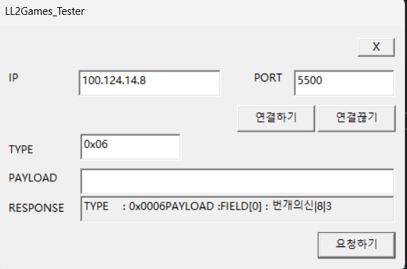
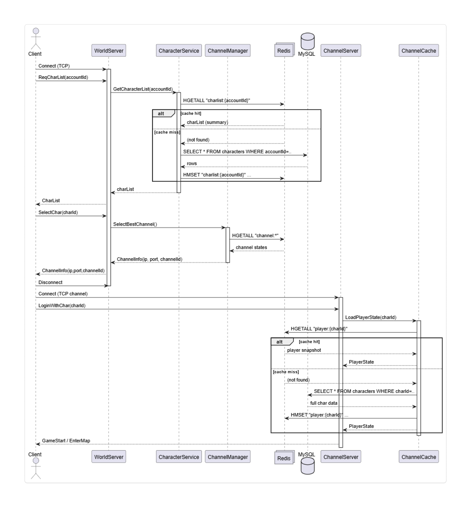
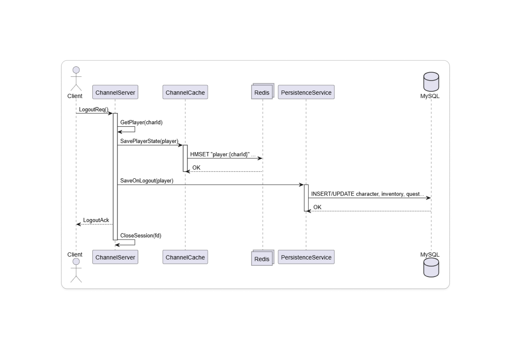

# 📝 팀 회의록

**날짜: 2025-12-20**
**작성자: geonwule**

---

## 1. 작업내용
### geonwule
 1. MySqlConnectionPool 구현
    - Init: pool 사이즈만큼 커넥션 생성
    - GetConnection/ReleaseConnection: MySql활용시 사용
 2. CharacterService 구현
    - GetCharacterList: mysql에서 캐릭터 리스트 검색
    - redis 구현 필요
 3. WorldInitHandler 수정
    - payload 파싱시 [L][V] 기준으로 파싱하는 로직 추가
 4. ClientTester 개발(LL2Games_Tester)
    - MFC 이용하여 모든 서버에서 활용할수있는 범용 테스터기 개발
    

### dyddlswogh
 1. ChannelServer.cpp 구현
 2. ChannelSession.cpp 구현
 3. Packet 구현

## 2. Action Items (다음 주까지)

| 담당자 | 작업 내용 | 기한 |
| --- | ----- | -- |
|  geonwule   | Redis구현     | 다음주 회의시    |
|geonwule|ChannelManager 구현|다음주 회의시|
|  dyddlswogh   | MySQL/Redis 구현      |  다음주 회의시  |
|  dyddlswogh   | Packet 구체화     |  다음주 회의시  |

---

## 3. 참고
### Client

### Server

* geonwule 서버설계 문서: https://gitmind.com/app/docs/foiur01z
---