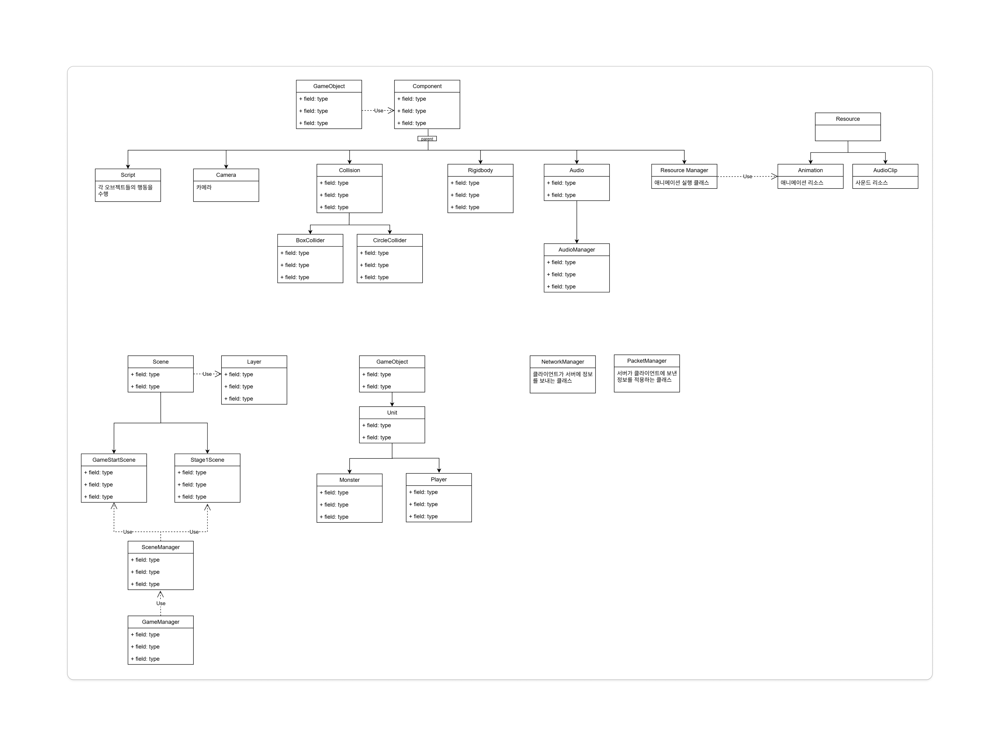
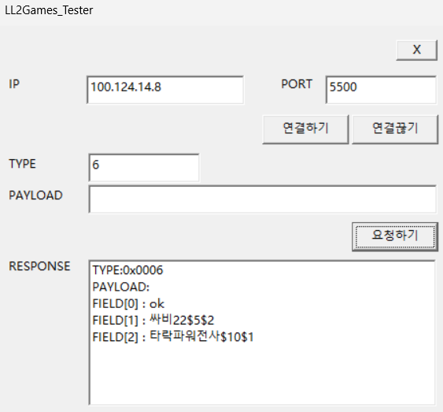
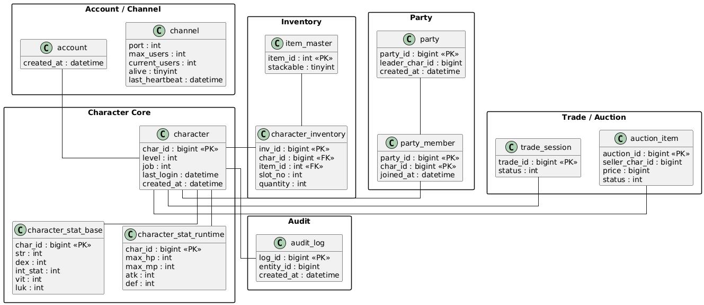

# 📝 팀 회의록

**날짜: 2026-02-08**
**작성자: gunoo22**

---

## 1. 작업내용

### geonwule
1. 스탯 능력치 조회 기능 추가
    - PlayerHandler -> HandleStatView 를 통해 클라이언트 요청 처리
    - PlayerService 내 Stat 조회 기능 추가
    - PlayerService: Mysql, Redis 로직 추가
2. 스탯 능력치 분배 기능 추가
    - PlayerHandler -> HandleStatUp을 통해 클라이언트 요청 처리
        * 입력값 statType ex) "str"
    - StatService::UpStat을 통해 스탯 분배
    - Player::CharacterStat 에서 인게임 스탯 분배
    - PlayerStatRepository 에서 db의 스탯 분배
        * 현재 db에 바로 스탯분배함.
```
 ----> 추후에 리소스손해를 방지하기 위해 Redis에 먼저넣고
       게임종료 등 특정주기에 db업데이트를 하는걸로 변경 예정
```

3. opcode 정의서 추가(14-feature-회의록-작성 branch)
    - 표형식으로 수정 (노션도 수정하였음)
    [Notion Link](https://www.notion.so/OpCode-2eac0b1b991d801eb110d15da0f735c4)

    

### dyddlswogh 
1. 플레이어해동 (공격/스킬) 구현
```cpp
//Player Attacker 구현
    1.CombatService 클래스 추가
        - 플레이어 공격에 관련된 기능들을 수행하는 서비스
    2. SkillService 클래스 추가
        - Json 파일로 이루어진 스킬들을 읽어오거나 이미 읽은 스킬에 대해서 정보를 반환해주는 클래스
    3. MapInstance 함수 추가
        - ResolveSkillHit : 플레이어가 스킬 사용 시 피격 당한 몬스터들을 처리하기 위한 함수
    4. Player 함수/변수 추가
        - 스킬 사용 시 사용 가능 여부를 확인하기 위한 정보들을 추가
        ( root_job : 0차 직업, m_learnedSkills : 해당 플레이어가 배운 스킬 목록, skillCooldownEndMs: 사용한 스킬에 대한 쿨타임 정보들 )
        - CanAttack 함수 추가
        - 현재 플레이어 상태가 스킬을 사용할 수 있는 상태인지 판단하는 함수 ( 플레이어 상태값, 쿨타임, 직업, MP등을 확인)
    5. PlayerHandler 수정
        - 기존 : PlayerHandler.cpp에 플레이어 행동에 관한 모든 함수가 존재
        - 변경 : PlayerHandler.cpp에는 Excute함수만 존재하고 플레이어 행동 관한 함수들을 따로 cpp 파일로 만들어서 관리 / 함수 정의는 PlayerHanlder.h 에 전방선언
    6. Commom 파일 추가
        - timeUtility.h / timeUtility.cpp 파일 추가 : NowMs (현재 시간을 milisecond로 측정하는 함수)
        - 시간 관련 함수들의 경우 모든 데몬에서 사용할 가능성이 높다고 판단해 common 폴더에 추가
    7. PlayerState 파일 추가
        - Player 상태에 관한 enum을 관리하는 .h 파일 추가
        - 현재 이름은 PlayerState이지만 후에 Player 관련 enum들을 관리하는 이름으로 변경 예정
    8. Skill_Info.h 파일 추가
        - Skill 정보들을 나타내는 enum class 및 스킬 정보를 담는 구조체를 구현해놓은 파일

//플레이어 공격 시스템 구성
   - CombatService : ComputeHitMonsters 함수 추가 - 현재 플레이어가 있는 맵에서 스킬 사용 시 피격 당한 몬스터들을 구하는 함수
        - 스킬 범위, 플레이어 방향, 공격 가능 수등 여러 요소를 종합적으로 계산해서 판단
   - Monster.h : 몬스터들 구별 ID 추가 ( 피격 판정을 위해서 추가)

   - Math 파일 추가
     - 플레이어 위치, 몬스터 위치, 스킬 정보들을 바탕으로 피격을 했는지 판정하는 함수 정의
```


## 2. 결정 사항


## 3. Sprint(다음 주까지)

| 담당자 | 작업 내용 | 기한 |
| --- | ----- | -- |
| geonwule   | 몬스터 행동 핸들러 구현  |  다음주 회의시  |
| | - 이동 | |
| | - 공격/스킬 | |
| | - 온데미지 | |
| dyddlswogh   | 플레이어 행동 구현 |  다음주 회의시  |
| | - 온데미지 | |
| | - 아이템 사용 | |


---

## 4. 참고
### Client


### Server




* geonwule 서버설계 문서: https://gitmind.com/app/docs/foiur01z
---
