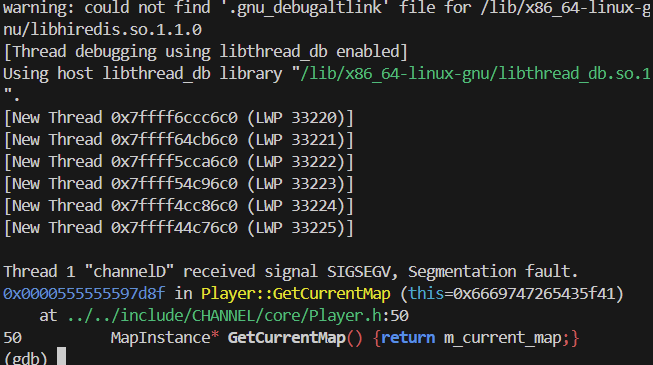
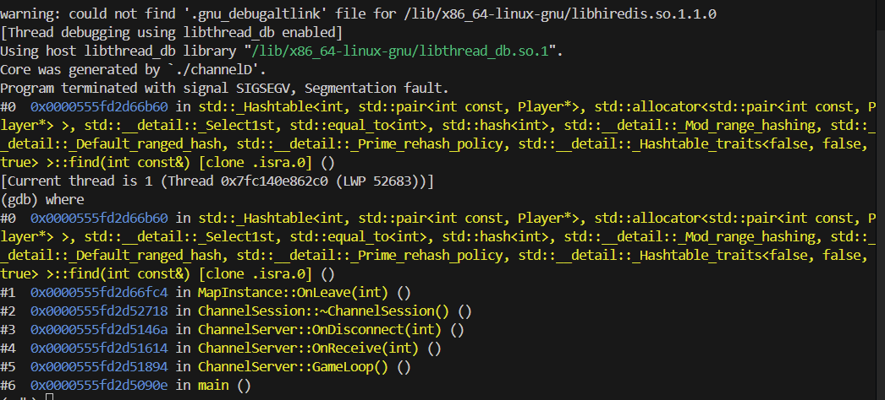

# 📝 팀 회의록

**날짜: 2026-03-02**
**작성자: gunoo22**

---

## 1. 작업내용

### 공통(서버 터지는 이슈를 잡기위해 회의시 작업함)
1. 서버실행후 Init(0x09)를 안하고 이동/공격(0x0b/0x0C)을 하면 서버터짐

  - 원인: Player::GetCurrentMap을 호출하는데 Player의 멤버변수 map이 초기화 되어있지 않음
  - 해결: m_current_map을 nullptr로 생성자에서 초기화
2. 서버 실행후 Init(0x09)와 맵진입(0x0a)을 교차로 하면서 연결 끊기시 서버 터짐

  - 원인: 연결끊기시 ~ChannelSession 호출, MapInstance::OnLeave() 호출 이때 PlayerList를 스레드에서 참조하는 동시에 erase를 해서 동기화 이슈로 추정
  - 해결: mutex로 lockguard를 걸어서 해결해보려 했으나 아직 해결못함.

### geonwule
1. 몬스터 행동 핸들러 원거리 공격 구현 완료
### dyddlswogh 
1. 플레이어 행동 온데미지 구현 완료

## 2. 결정 사항
- 26년 3월7일(토) 19:00 둘다 시간되면 잠깐 리마인드 차원에서 10~20분정도 회의 예정.

## 3. Sprint(다음 회의 까지)

| 담당자 | 작업 내용 | 기한 |
| --- | ----- | -- |
| geonwule   | 테스트  |  다음주 회의시  |
| | - 몬스터 테스트 | |
| dyddlswogh   | 테스트 |  다음주 회의시  |
| | - 플레이어 테스트 | |

---

## 4. 참고
### Client

### Server

* geonwule 서버설계 문서: https://gitmind.com/app/docs/foiur01z
---
