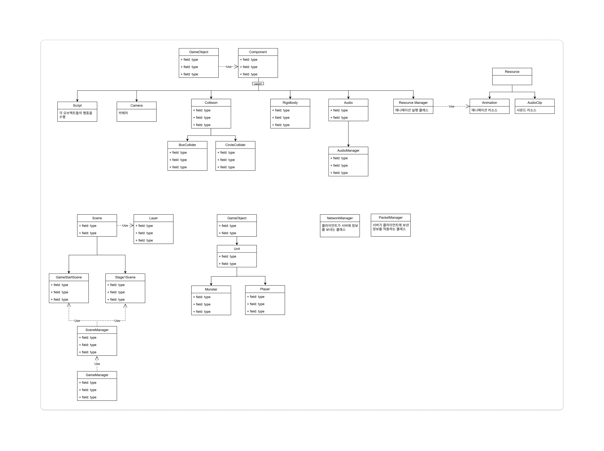
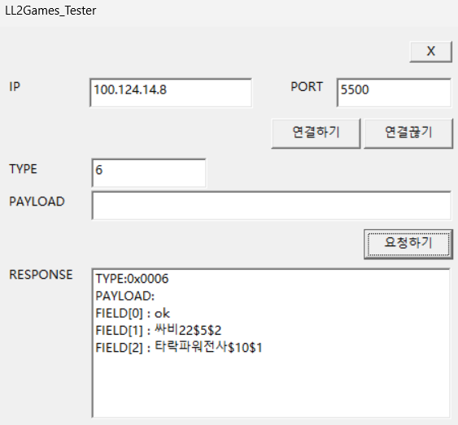
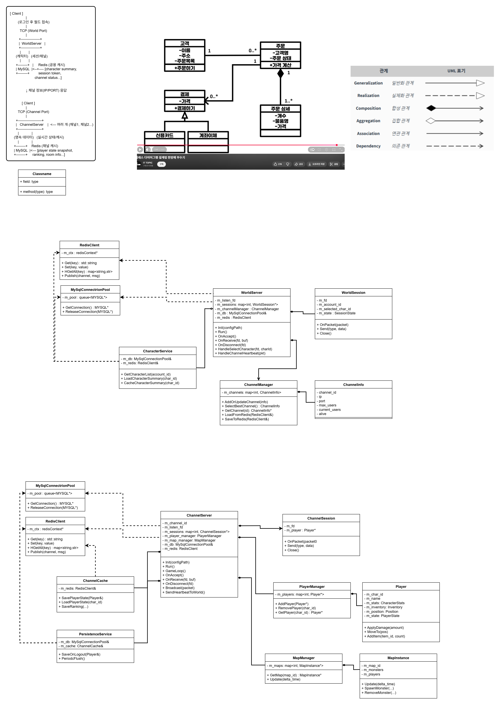
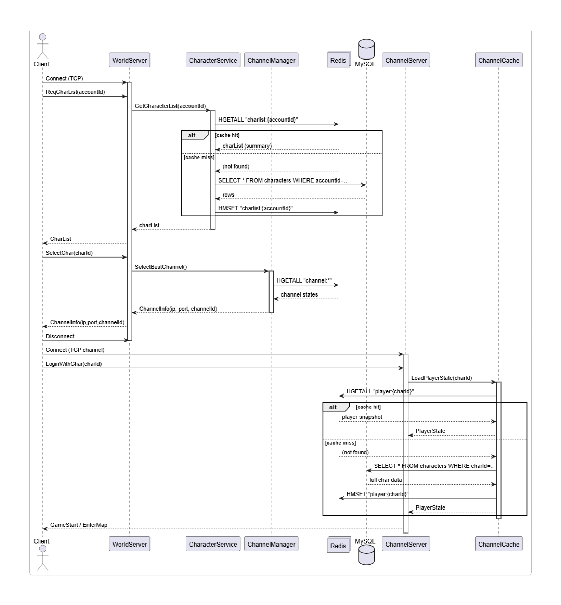
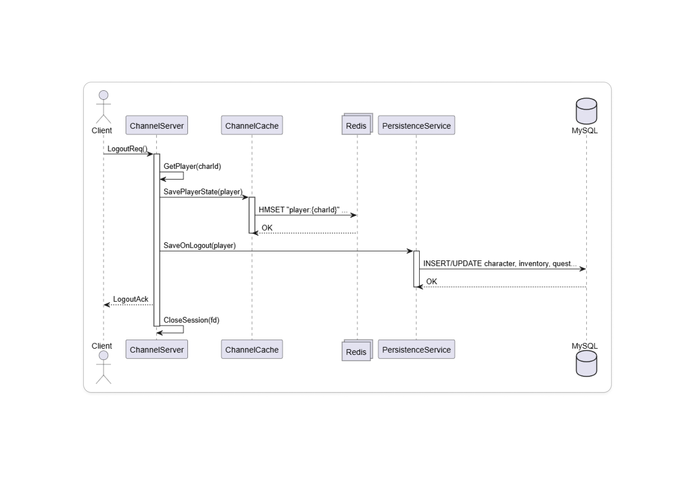
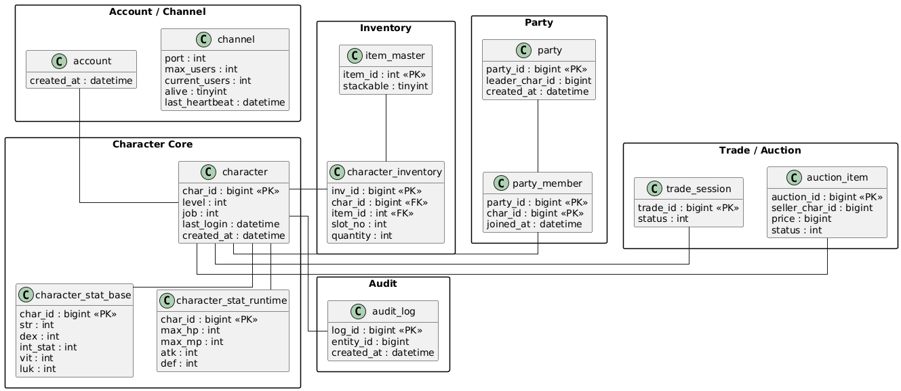

# 📝 팀 회의록

**날짜: 2026-06-13**
**작성자: geonwule**

---

## 1. 작업내용
### geonwule
1. 5월까지 작업한 DB테이블 명세서

### dyddlswogh 
1. OPCODE 노션 정리 (서버)
2. DB config 분리, sql 보완
3. 아이템 줍기 안되는 이슈 해결

## 2. 결정 사항
1) 클라이언트 채팅 정상화
2) 클라이언트 상대 플레이어 캐릭터 그리기 정상화(공격시)
3) 서버 멀티스레드 동기화
 - ex) DB접속하는 모든 애들은 다 스레드풀 사용 (메인 스레드의 lock방지)
4) 레디스를 채널간 상태 공유로 사용해보기
 - ex) 월드서버에서 채널진입시 레디스를 통해 점검중 혹은 인원 꽉참 등 상태확인
5) 서버 파일 및 폴더정리
 - Channel의 core에 과도한 파일들이 몰려있음.

## 3. Sprint(다음 회의 까지)

| 담당자 | 작업 내용 | 기한 |
| --- | ----- | -- |
| geonwule   |  클라이언트 채팅 정상화  |  다음주 회의시  |
| dyddlswogh   | 클라이언트 상대 플레이어 캐릭터 그리기 정상화(공격시) |  다음주 회의시  |

---

## 4. 참고
### Client

### Server

* geonwule 서버설계 문서: https://gitmind.com/app/docs/foiur01z
---
